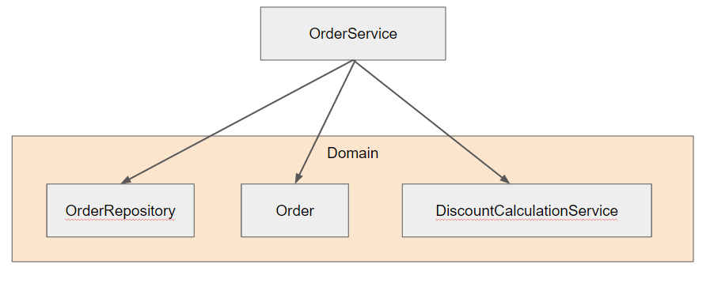

# 초보개발자 모임 제작겸 DDD 연습 프로젝트
### 구조
* 패키지구조
  - common
    - converter
  - posting
    - domain
    - repository
  - reply
    - domain
    - repository
  - member
    - domain
    - repository


### 중점 사항
* 페이징이 필요한 entity는 N:1 관계를 맺는다.
  - 1:N 관계를 많이들 생각하는데, 1:N의 경우 **하위 entity를 전체조회** 할수밖에 없기 때문에 페이징할때마다 전체조회로 성능상 이슈가 발생한다.
  - 하지만 N:1 관계로 하고 N의 repository 에서 1의 id로 조회를 하게 될 경우 위 이슈를 해결할 수 있다.

* entity간의 관계에서 애그리거트(entity 군 혹은 집합)가 다른 entity간의 관계는 객체참조가 아닌 ID참조를 하되 같은 애그리거트일 경우엔 객체참조를 한다.
  - 애그리거트가 다른데 객체 참조를 하게 될 경우 물리적 DB 분리시에 분리영역이 모호해진다. 
  - ex) ```replyRepository.findByPostingIdx (posting.getIdx())``` 
  - 즉 Posting(원글)과 댓글의 관계는 N:1이며, 이를 ManyToOne으로 하지 않고, reply과 postingIdx만 가지도록 한다. (페이징을 위해)
  - 반대로 Reply와 Member간의 관계는 댓글 작성자가 누구인지 바로 보여줘야 하므로 ManyToOne 양방향으로 객체참조를 한다.
  - Posting과 Member의 관계는 ManyToOne 양방향으로 객체참조를 한다.
    - Member 객체 조회시 해당 사용자가 작성한 글의 갯수가 10만개 100만개가 될리는 거의 없기 때문이다.
    
* setter는 생성하지 않는다.
  - 의도가 명확하지 않은 entity의 상태 변경을 막기 위해
  - 상태변경은 의도가 명확한 메소드명으로 생성할 것
  - ex) cancel(), shuffle() 등

* 서비스 계층은 아래의 역할에만 충실히 한다.
  - 도메인 객체간의 실행흐름 제어 (즉, 도메인 로직은 도메인 객체에서 담당한다.)
    - 도메인 데이터와 도메인 로직이 한 영역에 위치하지 않으면 해당 로직을 파악하기 위해 여러 영역을 분석하게 된다.
    - 여러 서비스 계층에서 동일한 도메인 로직을 구현할 확률이 높다.
  - 트랜잭션 처리

* 서비스 클래스의 경우 무조건 각각의 도메인에 종속시키지 말자.
  - 일반적으로 하나의 도메인에 맞춰 컨트롤러, 서비스 클래스를 생성한다.
  - 이럴 경우 여러 서비스 클래스에서 중복되는 기능의 경우 위 규칙을 따라갈 경우 중복 제거가 애매해진다.
  - 중복 기능의 경우 별도의 서비스 클래스를 생성해서 재사용을 하자.

* 서비스 클래스는 인터페이스를 거의 두지 않는다.
  - 인터페이스는 여러 구현체가 있고, 이를 런타임 단계에서 골라 쓸때 사용되는데 서비스 클래스는 그런 경우가 거의 없다.
  - 서비스 계층에서 인터페이스를 사용하면 **복잡도만** 높아질수 있다.

* 서비스 클래스는 뷰에서 사용할 값만 리턴한다.
  - 뷰에서 사용할 값외에 추가로 전달하게 되면 컨트롤러에서도 로직을 실행시킬 여지가 생긴다.
  - 코드의 응집도를 높이기 위해 컨트롤러는 서비스에서 받은 값을 그대로 뷰에 전달만 하자.

* 서비스와 컨트롤러 영역의 구분을 명확히하자  
  - HttpServletRequest나 HttpServletSession을 바로 서비스 클래스로 전달하는 등의 행위
  - 서비스클래스에서 HttpServletSession을 생성하고, 세션 인증을 하는 등의 행위
  - 위와 같은 행위는 컨트롤러의 영역에서 해야할 일이 서비스 영역으로 넘어가버린 것이다.
  - 컨트롤러 역여의 역할은 컨트롤러에서 진행한다.

* 컨트롤러 (표현) 계층은 아래의 3가지 책임이 있다.
  - 화면 흐름 제공 및 제어
  - 사용자의 요청에 맞는 서비스 호출 및 결과 제공
  - 사용자 세션 관리

* Spring의 Validator 인터페이스를 활용해서 입력값의 유효성을 검사하자.
  - Controller : 필수값, 값의 형식, 범위등 체크 
  - Service : ID 중복여부, Null 등 체크 (논리적 오류)

* 꼭 응용 서비스가 아니라도 도메인 서비스를 만들 수도 있다.
  - 할인 금액 규칙 계산처럼 한 애그리거트에 넣기 애매한 도메인 개념을 구현할때 억지로 넣기지말자.
  - 차라리 도메인 서비스 계층을 만들어 해당 서비스에 그 일을 맡기자.
  - 단 도메인 서비스는 **상태 없이** 로직만 구현되어 있다.
  - 해당 로직이 도메인 서비스인지 응용서비스 인지 구별이 어렵다면, 애그리거트의 상태를 변경하는지 안하는지 여부로 판단하자.
  - 혹시나 도메인 서비스가 외부 시스템에 의존하고 있을 경우 인터페이스로 분리해도 무관하다.
  


(도메인 서비스의 위치) <br/> <br/>

* 쓰레드 충돌시 해결 방법은 **선점 잠금**과 **비선점 잠금**이 있다.
  - 예를 들어 운영자가 배송 준비로 변경중에 사용자가 배송지 정보를 변경하면 어떻게 될까?
  - 선점 잠금: 먼저 호출한 쪽의 사용이 끝날때까지 다른 스레드에서 해당 애그리거트의 수정을 막는 방식
  - 비선점 잠금: 애그리거트에 수정내역 버전을 두는것과 비슷한 기법
    - 행여나 낮은 버전으로된 애그리거트가 update 요청을 주면 무시하고, 높은버전 혹은 동일한 버전이면 update한다.
    - JPA에서는 ```@Version``` 으로 해당 애그리거트의 버전관리가 가능해진다.
  - 오프라인 선점 잠금: 한 쓰레드에서 사용중일 경우 다른 쓰레드에서 사용을 못하도록 막는 방법
    - 트랜잭션 시작단계에서 잠금 선점후, 트랜잭션 종료시에 잠금을 해제
    - 이 과정에서 다른 사용자는 잠금에 대한 권한을 받을 수 없다.
    
* 외부서비스를 사용할 경우 이벤트 방식을 적극 활용하기
  - 이벤트명은 ```OrderCanceledEvent.java```와 같이 과거시제를 사용해야 한다. (과거에 벌어진 상태변화나 사건을 의미하므로) 
  - 사용이 끝난 이벤트는 바로 초기화하기 (아니면 쓰레드에 너무많은 이벤트 객체가 생성되어 OOME가 발생한다.)

* CQRS 
  - 구현의 복잡도를 낮추기 위한 패턴
  - 조회를 위한 모델과 수정과 같은 상태변경을 위한 모델을 분리하는 것
  - 상태변경 모델의 경우 각각의 객체를 기반으로 한 도메인 모델을 이용
  - 조회 모델의 경우 필요한 정보를 모두 담고 있는 새로운 데이터 타입을 이용
  - 이에 따라 퍼시스턴트 계층 기술도 필요에 따라 나눠쓸수 있다.
    - 상태변경 : JPA (객체형 모델링에 좋은)
    - 조회 : MyBatis (SQL 조회가 쉬운)
  - 단, 구현에 많은 리소스가 필요하다.
  
  
### 알게된 사실
* Pageable의 Desc옵션은 limit 이후가 아니라 limit 이전에 적용된다.
  - 만약 ```new PageRequest(1, 30, Sort.Direction.DESC, "updateDate");``` 로 생성하면, DESC -> 2번째 페이지 -> 30개가 추출된다.
  - Repository의 결과는 Stream도 된다.
  - 추출된 데이터들 사이에서 좀 더 다양한 형태로 변경하고 싶을때는 Stream을 적극적으로 사용한다.

* 순수 뷰의 역할만 하는 Entity라면 **@Immutable**을 사용하여 변경사항을 무시하도록 하자.
  - @Subselect 를 통해 추출된 Entity의 경우 대부분이 뷰의 역할이다.
  - 하지만 실수로 해당 Entity를 수정하게 될 경우 JPA는 update 쿼리를 실행시킬 것이다.
  - 이를 코드상에서 방지하기 위해 @Immutable을 사용하자.

* 하나의 메소드에서 동일 Entity들의 변경 및 조회가 있을 경우 **@Synchronize**를 사용하자.
  - 예를 들어 Order Entity를 조회하여 상태를 변경후 OrderList를 조회할 경우 OrderList에는 변경된 Order Entity가 조회되어야 한다.
  - 하지만 JPA는 트랜잭션 종료 시점에서 update가 발생하므로 update 이전의 Order가 조회되버린다.
  - @Synchronize를 사용하면 로딩되는 엔티티에서 변경사항 발견시 flush를 먼저 실행시키고 로딩이 실행된다.

* JPA는 같은 트랜잭션일 경우 같은 객체가 조회되는 것을 보장한다.
  - 즉, 동일 트랜잭션에서의 메소드에서는 조회된 결과를 ```==``` 비교했을 때 true가 전달 될 수 있다.

* new 커스텀Exception()를 아끼지 말자.
  - 생각보다 많은 샘플 코드에서 new 커스텀 Exception을 발생시키고 있다.
  - 정상적인 경우를 제외하면 ```return null;``` 이 아니라 ```throw new 커스텀Exception```을 하는게 더 어울린다.

* Spring Data Jpa의 경우 각 Entity 클래스들은 디폴트 생성자가 필수다.